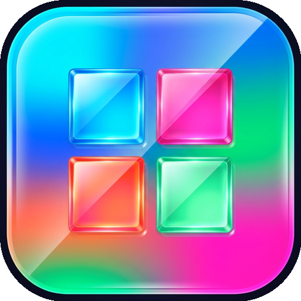

<p align="center">
  
</p>

# App Launcher — Ultra-Clean Categorized Android Launcher

An ultra-clean, minimalist Android launcher built with **Jetpack Compose** and **Material 3**. It transforms cluttered multi-page home screens into a sleek, single-screen experience with wallpaper transparency, smart app reminders with voice alarms, and 3 distinct layout modes.

[](https://github.com/bapanayya/App-Launcher/actions/workflows/android-build.yml)
[](https://github.com/bapanayya/App-Launcher/releases/latest)

---

## ✨ Key Features

1. **Wallpaper Transparency**:
   - The device wallpaper and screen saver remain clearly visible behind the single home screen slide.
   - Elegant dark frosted glass cards (`alpha: 0.38 - 0.45`) with crisp typography and subtle drop shadows ensure complete text legibility over any wallpaper (bright, dark, or multi-colored).
   - Smooth animated translucent dark scrim when opening the App Launcher drawer.

2. **3 Layout Modes Inside App Launcher**:
   - **📑 Sections**: Categorized rounded cards on continuous scroll with category headers, app counts, and 4-column app layout.
   - **▦ Grid**: Compact 4-column app grid for quick visual scanning.
   - **☰ Minimal List**: Ultra-clean vertical list with compact icons, bold app names, and category tag badges.
   - Layout preference is automatically persisted across app restarts.

3. **Single Clean Home Screen**:
   - Eliminates messy multi-slide home screens.
   - Home screen only displays:
     - Center Hub: **App Launcher**, **Settings**, **Play Store**, and **Gallery / Photos**.
     - Bottom Dock: **Phone / Calls**, **Messages**, default **Browser**, and **Camera**.
   - All newly installed apps automatically fall into their respective categories and never clutter the home screen.

4. **Category Customization & Reordering**:
   - Create custom categories on the fly.
   - Easily move categories up and down (`▲` / `▼`) to customize your preferred viewing order.
   - Reassign any app to any category with a simple long press.

5. **App Reminders with Buzzer & Voice Alerts**:
   - Set one-time or daily repeating reminders for any app (e.g. APFRS attendance at 9:00 AM).
   - Exact alarm manager buzzer with customizable Text-to-Speech (TTS) voice announcements (e.g. *"You Need to Post Attendance"*).
   - Automatically reschedules reminders across device reboots.

---

## 🔒 Privacy & Security Guarantee

- **100% On-Device & Offline**: Zero internet connections or external telemetry. All classification and reminders run locally on your phone.
- **Sandboxed Execution**: Launching apps utilizes explicit Android `Intent.ACTION_MAIN` via `startActivity()`. App Launcher never accesses any private app data.
- **Google Play Compliant**: Uses standard launcher role and permission models.

---

## 📥 Download & Install

You can download the ready-to-install Android APK directly from the [GitHub Releases](https://github.com/bapanayya/App-Launcher/releases/latest):

1. Download **`AppLauncher.apk`**.
2. Tap the APK on your Android phone and select **Install**.
3. Press the Home button and select **App Launcher** -> **Always** to set it as your default launcher.

---

## 🛠️ Build from Source

```bash
git clone https://github.com/bapanayya/App-Launcher.git
cd App-Launcher
./gradlew assembleDebug
```
The compiled APK will be generated at `app/build/outputs/apk/debug/app-debug.apk`.
